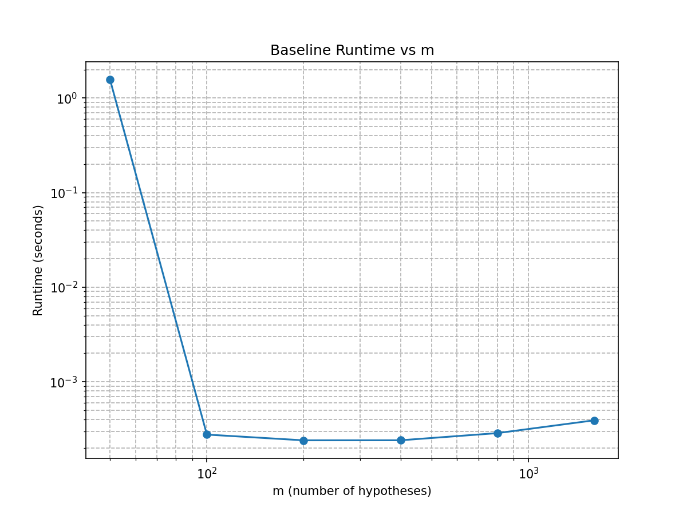

# Unit 3 – Baseline Performance (Unoptimized Simulation)

This document records the baseline performance of the original (Unit 2) simulation code.

---

## 1. Code Version

- Baseline code location: `unit-3/baseline/`
- Original source (copied from Unit 2): `simulation-study-unit2/src/`
- Python version: TODO
- Machine info (CPU/RAM): TODO

---

## 2. Baseline Runtime (Before Optimization)

### 2.1 Total Runtime

Command:
```bash
python baseline/simulation.py
```

Measured runtime: 20.647 seconds (real time from `time python simulation.py`)


### 2.2 Breakdown (if measurable)

- DGP time: TODO
- Method application time: TODO
- Metrics computation time: TODO

---

## 3. Profiling Summary

Profiler used: cProfile (will fill in Step 2)

Top bottlenecks (sorted by cumulative time):

1. threading.py:641(wait) — 23.252 seconds  
   → This includes time the program spends waiting on system operations; not a direct computational function.

2. simulation.py:44(run_single_simulation) — 12.828 seconds  
   → Main core of the simulation. Called 27,000 times.

3. dgps.py:14(generate_pvalues) — 9.430 seconds  
   → Data generation step. Also called 27,000 times.

4. simulation.py:91(run_simulation) — 3.180 seconds  
   → Loop over simulation conditions; includes DataFrame assembly and storage.

5. pandas.core.frame: __init__ — 2.800 seconds  
   → Overhead from repeatedly creating DataFrames (27,001 times).

6. pandas.core.internals.construction.dict_to_mgr — 2.479 seconds  
   → Internal DataFrame construction overhead.

7. scipy.stats._stats_py import overhead — 3.657 seconds  
   → One-time import cost, not repeated per simulation.


---

## 4. Empirical Computational Complexity

We will later run:
```bash
make complexity
```

Planned outputs:
- runtime vs sample size (n or m)
- log-log plot in `unit-3/results/figures/baseline_complexity.png`
- estimated complexity: TODO

### Complexity Plot



---

## 5. Numerical Stability Issues

Record any:
- overflow/underflow warnings
- NaN p-values
- instability in variance or BH threshold comparisons

For now:
- Observed issues: TODO

---

## 6. Summary

This file will be updated after profiling and timing in Step 2.
