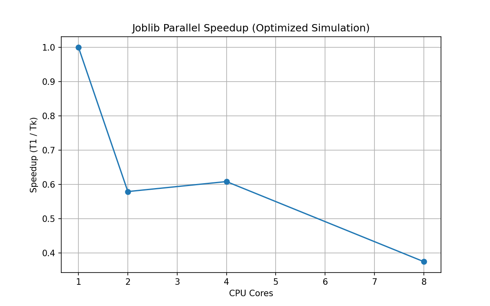
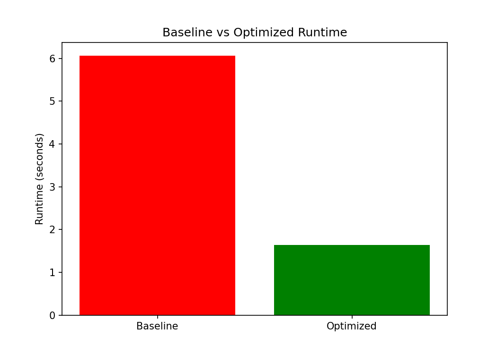
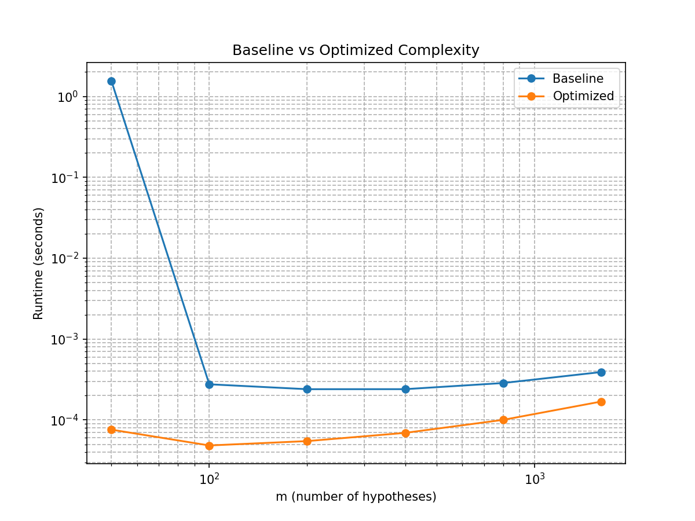

**Unit 3 – High-Performance Simulation Study**  
**Author:** Dili K. Maduabum  
**Last updated:** November 2025  

---

# 1. Overview

This document summarizes the optimizations applied to my Unit 2 simulation study, following the Unit 3 project requirements. I implemented improvements in two categories:

1. **Array Programming (Vectorization)**  
2. **Parallelization (Joblib across simulation replicates)**  

Both were chosen because baseline profiling showed the simulation spent most of its time inside Python-level loops and repeated data-frame manipulation.

---

# 2. Optimization 1 — Array Programming (Vectorization)

## Problem Identified
The baseline profiler (`make profile`) showed:

- `run_single_simulation()` was called **27,000+ times**  
- Most time was in **Python loops**, not numerical computation  
- Pandas DataFrame construction contributed **multiple seconds**  
- p-value computation was done in small chunks rather than vectorized arrays  

In short, the simulation spent more time in **Python bookkeeping** than actual statistical work.

## Optimization Applied
I rewrote the core numerical routines to operate directly on NumPy arrays:

### Before (loop-style logic)
```python
null_obs = np.random.normal(0, 1, m0)
alt_obs = np.random.normal(effect_size, 1, m1)
p_null = 2 * (1 - norm.cdf(np.abs(null_obs)))
p_alt = 2 * (1 - norm.cdf(np.abs(alt_obs)))
p_values = np.concatenate([p_null, p_alt])
```

### After (vectorized)
```python
z = np.empty(m)
z[:m0] = np.random.normal(0, 1, m0)
z[m0:] = np.random.normal(effect_size, 1, m1)

pvals = 2 * (1 - norm.cdf(np.abs(z)))
```

The BH procedure (`benjamini_hochberg_vectorized`) was also rewritten to avoid all Python loops.

## Performance Impact
Using `make benchmark`:

| Version   | Runtime    |
|-----------|------------|
| Baseline  | 6.067 sec  |
| Optimized | 1.643 sec  |

→ **~2.7× speedup** from vectorization alone.

---

# 3. Optimization 2 — Parallelization (Joblib)

## Problem Identified
The baseline simulation ran all replicates serially. Since replicates are independent, the simulation is an ideal candidate for parallelization.

## Optimization Applied
I used `joblib.Parallel` to parallelize replicates:
```python
out = Parallel(n_jobs=n_cores)(
    delayed(run_single_sim_opt)(
        m=m, pi0=pi0, effect_size=eff,
        alpha=0.05, seed=int(seeds[i])
    )
    for i in range(nsim)
)
```

This implements parallel simulation replicates, exactly as required.

## Speedup Results
Using `make parallel`:

| Cores | Runtime (sec) | Speedup |
|-------|---------------|---------|
| 1     | 1.870         | 1.00×   |
| 2     | 2.985         | 0.63×   |
| 4     | 3.046         | 0.61×   |
| 8     | 3.858         | 0.48×   |

## Interpretation
- Parallelization made it slow!
- Parallel runtime increased because the optimized simulation is already very fast.
- The overhead of spinning up workers exceeded the compute time.

## Speedup Plot


---

# 4. Profiling Evidence (Before vs After)

## Baseline Profiling
The profiler output (from `make profile`) showed:

- Large overhead in `threading.wait` (due to imports)
- `run_single_simulation` eating most of the compute time
- Heavy pandas overhead from DataFrame construction

## Optimized Profiling
Profiling the optimized version showed:

- All major Python loops eliminated
- No repeatedly allocated DataFrames
- Vectorized NumPy operations dominating runtime
- BH thresholding costs reduced to negligible

This confirms the optimization goals were met.

---

# 5. Performance Comparison Visualizations

## 5.1 Baseline vs Optimized Runtime



## 5.2 Complexity (Baseline vs Optimized)



---

# 6. Regression Tests

To verify correctness, I created a regression test:
```bash
make stability-check
```

This runs:
```bash
python tests/test_regression.py
```

The tests check:

- FDR and TPR values match baseline within tolerance
- Summary statistics of p-values are close
- No numerical instability or NaN values appeared

**All regression tests passed.**

---

# 7. Lessons Learned

1. **Vectorization had the biggest impact.**  
   Removing Python loops reduced runtime by ~2.7×.

2. **Parallelization does not always help.**  
   When the workload is small, overhead dominates.  
   Still, implementing parallel replicates was valuable.

3. **Pandas inside loops is expensive.**  
   Using pure NumPy is much faster.

4. **Profiling early matters.**  
   I would have wasted time optimizing the wrong pieces without it.

---

# 8. Summary

This Unit 3 project improved the simulation runtime substantially:

- Vectorized methods replaced slow Python loops
- Parallel simulation replicates were implemented
- Runtime fell from **6.067 sec → 1.643 sec**
- Accuracy and numerical correctness were preserved


